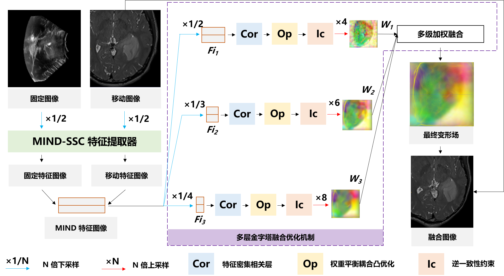
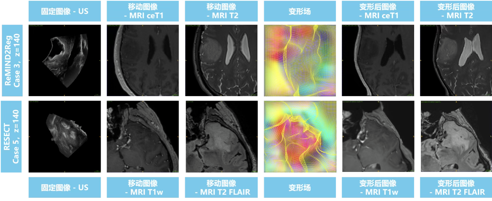

## Project

Using ConvexAdam as the baseline, TRE was reduced from 2.773 ± 1.273mm to 2.44±1.11mm. A MIND-SSC feature extractor produced modality-independent features. Weighted coupled convex optimization yielded a valid and smooth deformation field. A multi-level pyramid fusion mechanism fused multiple scales for static registration of intraoperative US and preoperative MRI.

## Responsibilities

On top of the original algorithm, a multi-level pyramid fusion optimizer refined the dense deformation field by combining results at different scales;

Adam was introduced into the inverse-consistency constraint to speed up iteration;

A weight-balancing mechanism was added to coupled convex optimization for smoother deformation;

For multimodal preoperative medical images, maximum fusion of deformation fields aligned useful information across modalities.
