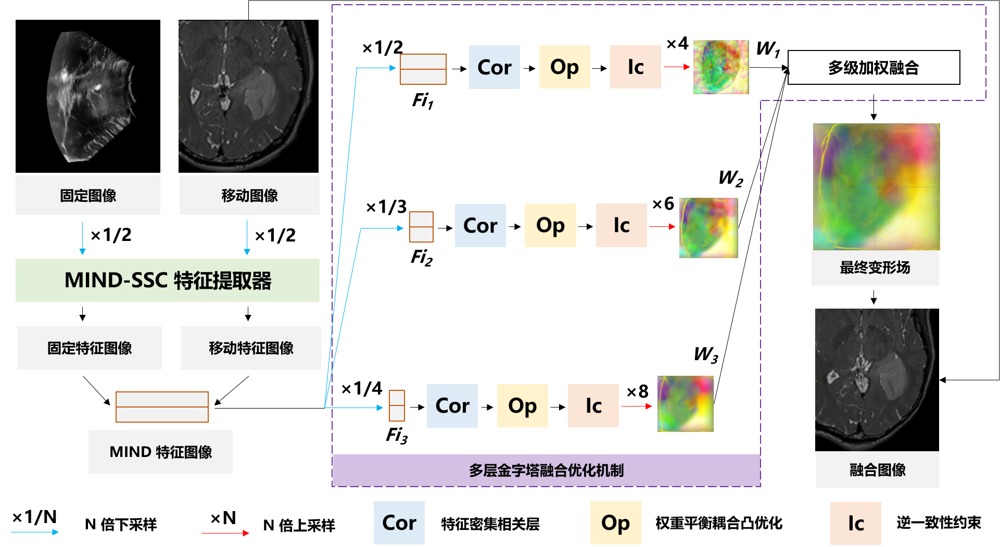
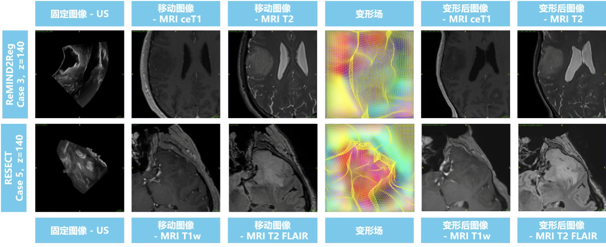

---

## date: 2025年04月
title: 无监督多模态图像配准方法研究
image: reg-framework.png
content: 以ConvexAdam为基线，对术中US和术前MRI实现静态配准，将TRE从2.773 ± 1.273mm降低至2.44±1.11mm。
tags: [多模态, 图像配准, Python]

## 项目内容

以ConvexAdam为基线，将TRE从2.773 ± 1.273mm降低至2.44±1.11mm。使用MIND-SSC特征提取器提取模态独立特征，利用权重平衡耦合凸优化得到有效且平滑的变形场，通过多层金字塔融合优化机制实现多尺度融合，对术中US和术前MRI实现静态配准。

## 负责工作

在原有算法基础上加入多级金字塔融合优化机制，通过融合不同尺度的优化结果，实现了密集变形场的精细化；

在逆一致性约束中引入Adam优化，提高了迭代速度；

在耦合凸优化上引入权重平衡机制，以实现更平滑的变形；

针对多模态术前医学图像，通过形变场的最大融合实现不同模态间有效信息的对齐。