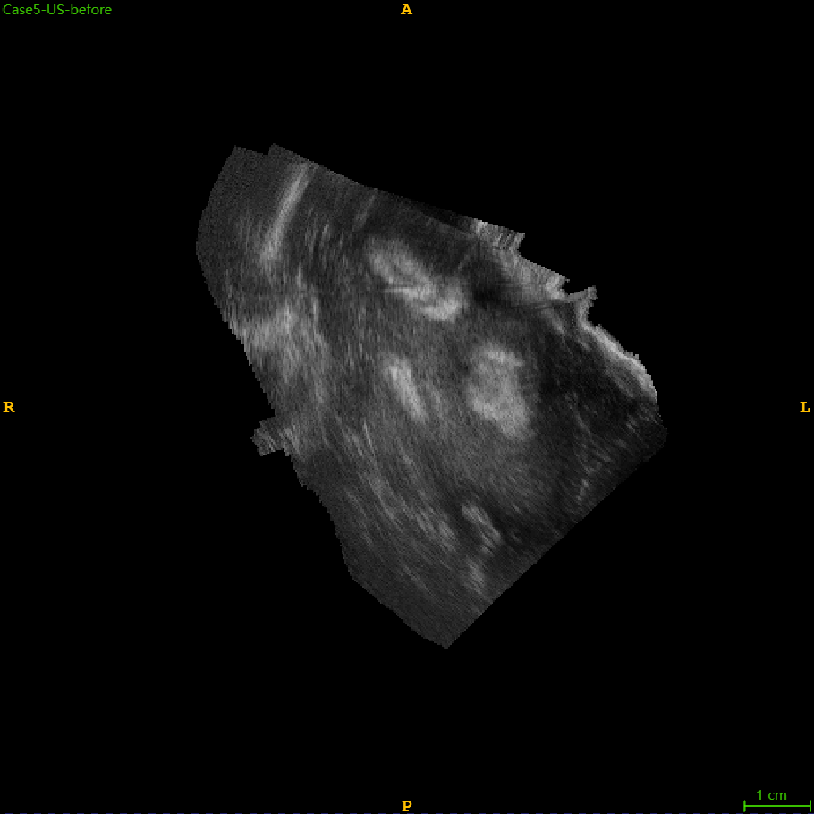
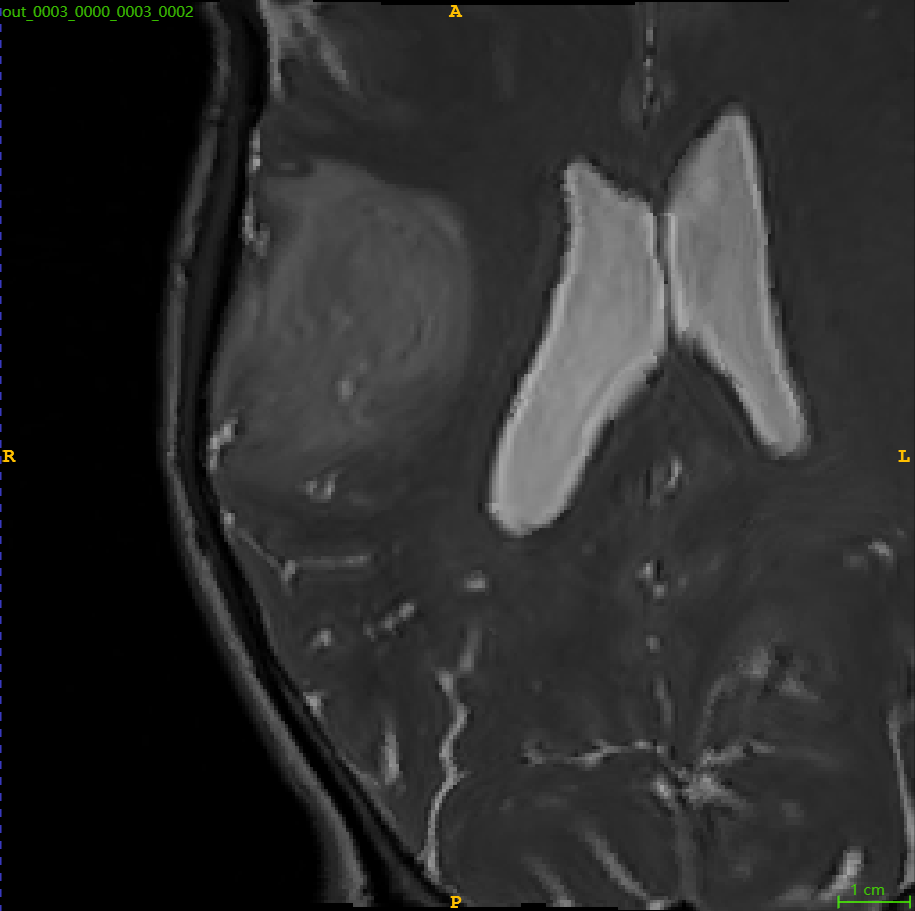
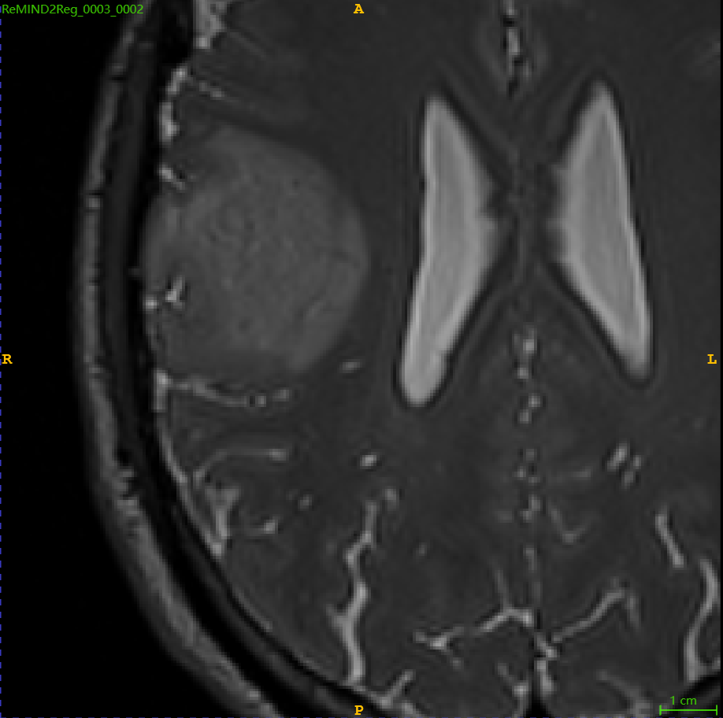
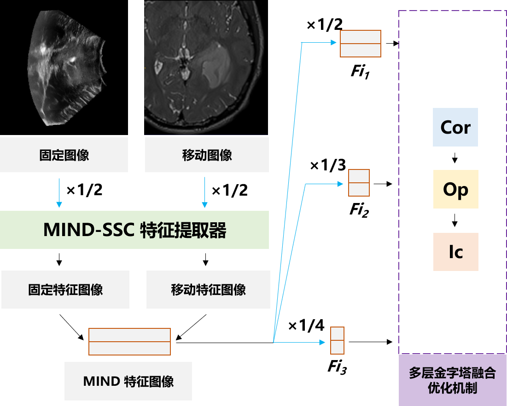

## 项目内容
毕业设计将 TRE 从 2.773±1.273mm 降至 2.44±1.11mm，使用 MIND-SSC 特征提取器提取独立特征，利用权重平衡优化得到有效且无监督的形变场，再通过多层金字塔优化做多尺度对齐，对术中 US 与术前 MRI 实现静态配准。

固定图像为术中超声。

移动图像为术前 MRI。

配准后得到变形的 MRI。

## 负责工作
针对不同模态的术前医学图像做模块化适配，并在特征提取前加入前采样。

在原有算法中加入多级金字塔，耦合不同尺度的优化结果。

在一致性约束中加入 Adam，在耦合优化中引入权重平衡，得到有效且无监督的形变场。

