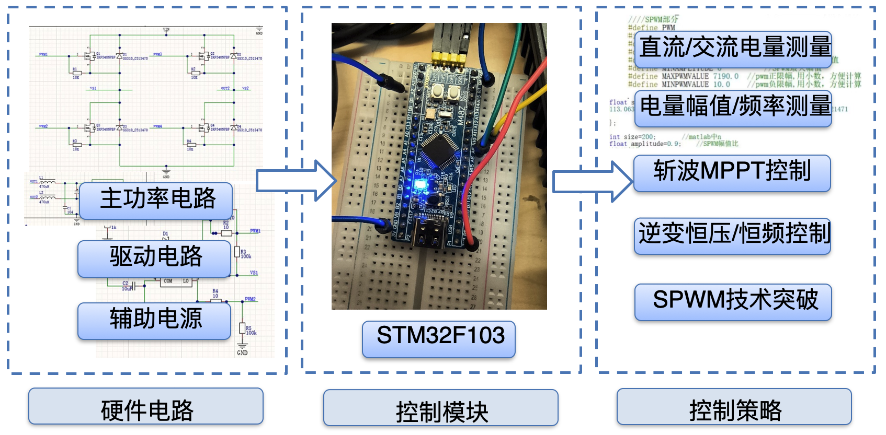
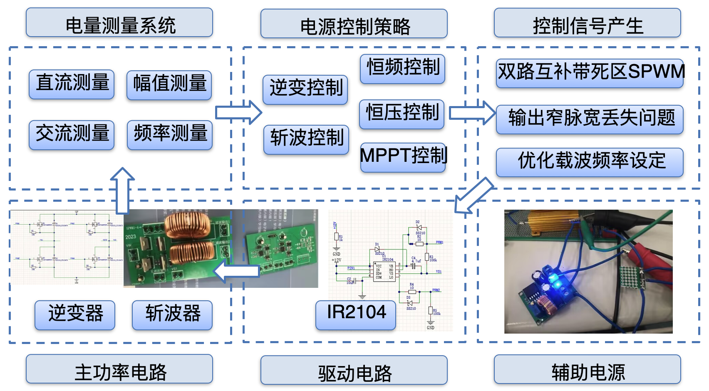

## Project
A 32-bit MCU as the controller for an integrated power system, including the main power stage, control, auxiliary supply, gate drive, and sampling, meeting specified voltage regulation, load regulation, and efficiency.

Tests of the inverter: frequency 50Hz, efficiency 91.25%, THD 3.9%, voltage 24.00V.

## Responsibilities

Wrote all control software in C.

Measurement: DMA ADC sampling and the DSP library for DC and AC amplitude and frequency;

Control: PID for chopper MPPT and inverter constant-voltage, constant-frequency control;

SPWM: complementary dual-channel SPWM with dead time, fixing missing narrow pulses, and better duty-cycle and harmonic settings for circuit performance.

