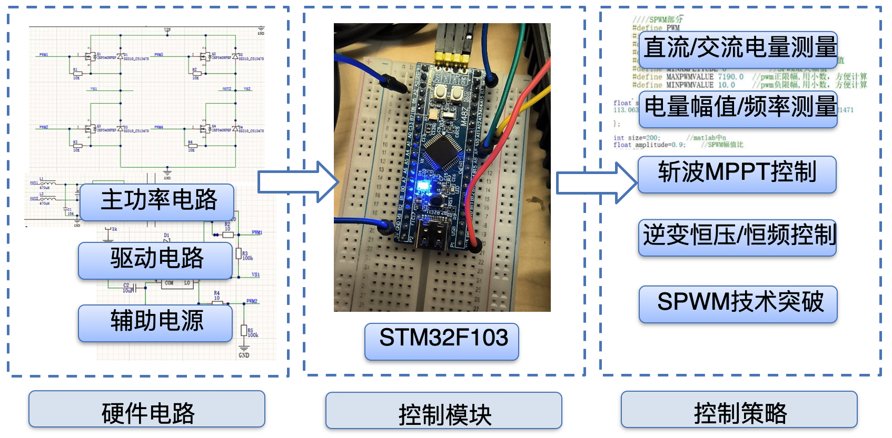
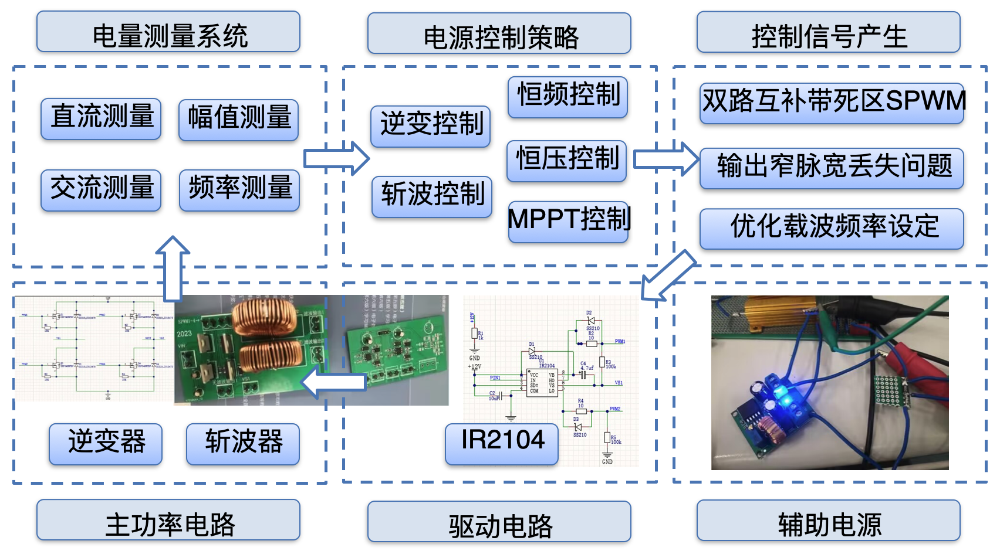

## 项目内容
以32单片机为主控，设计综合电源系统，包括主功率电路、控制电路、辅助电源、驱动电路、采样电路，可满足规定电压调整率、负载调整率、效率等要求。

经过测试得到，所搭建逆变系统性能为：频率：50Hz，效率：91.25%，THD:3.9%，电压：24.00V

## 负责工作

负责全部控制程序编写（C 语言）。

电量测量系统设计：使用DMA方式进行ADC采样，调用DSP库计算直流、交流电压的幅值、频率等；

电源控制策略设计：使用PID实现斩波器的最大功率点跟踪（MPPT），逆变器的恒压、恒频控制等；

SPWM技术突破：成功实现双路互补SPWM带死区的输出，解决输出波形窄脉宽丢失问题，通过优化占空比设定和谐波畸变率调整，提升电路性能。

