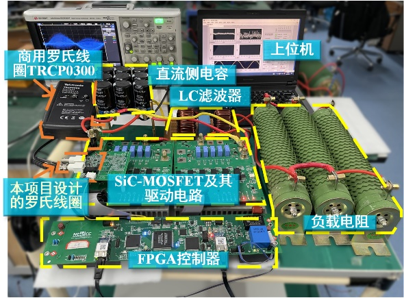
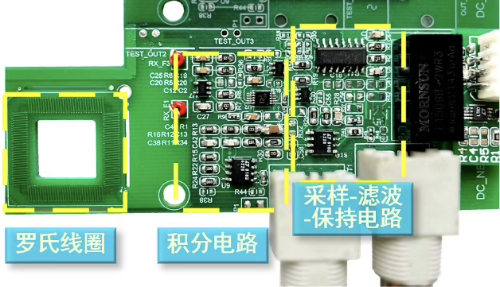
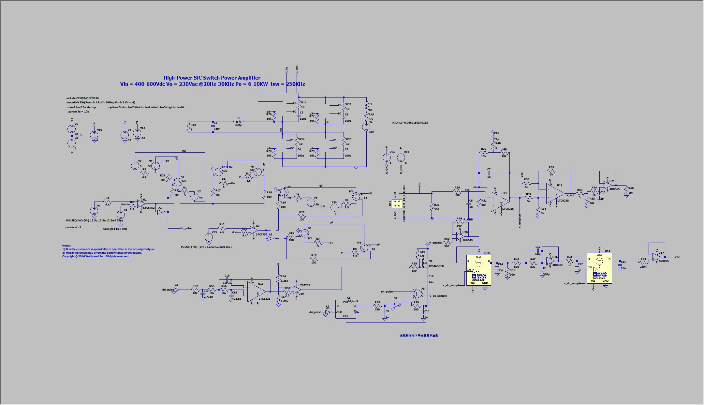
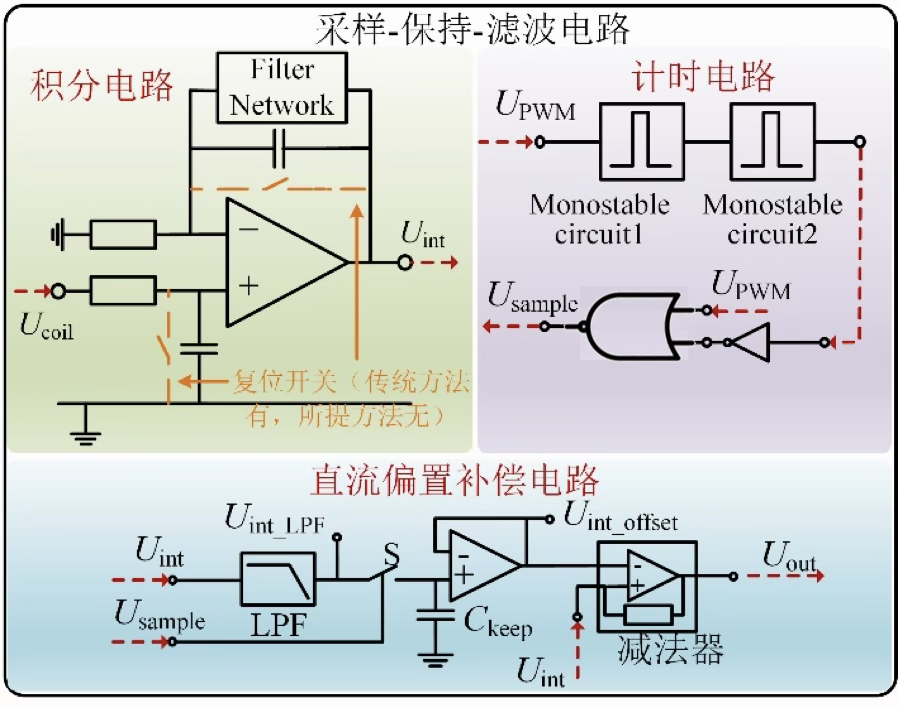
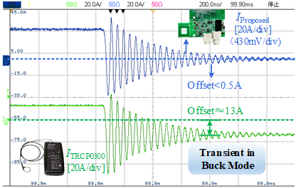

## Project

A Rogowski coil as the front-end differentiator, followed by a low-DC-offset integrator and a DC compensation circuit, for a high-immunity, high-sensitivity current sensor.

## Responsibilities

Targeting high bandwidth, low DC offset, and high gain, I chose a passive–active cascaded integrator. Tests showed gain above 10e6 with bandwidth of 33.6MHz.

A sample–filter–hold (SFH) method recovered the DC component lost in the integrator. After circuit simulation and debugging, Buck current waveforms were used to check integration and compensation; DC offset fell from 13A to 0.5A.

<!--  -->
