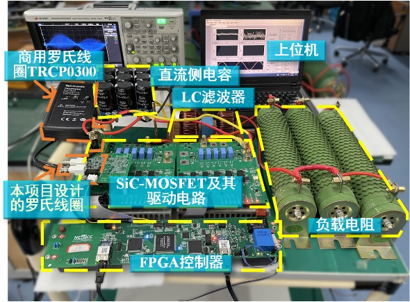
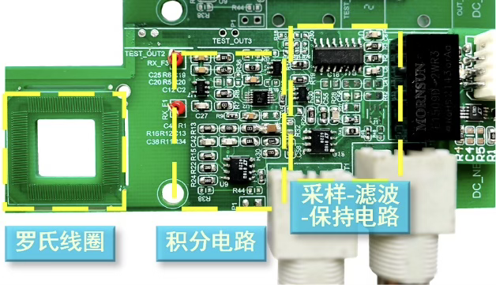
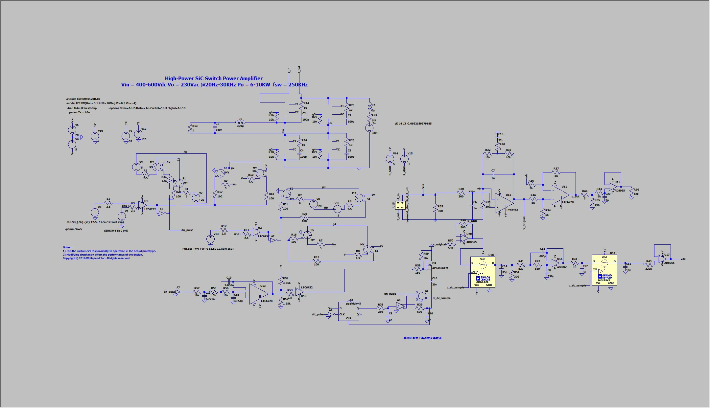
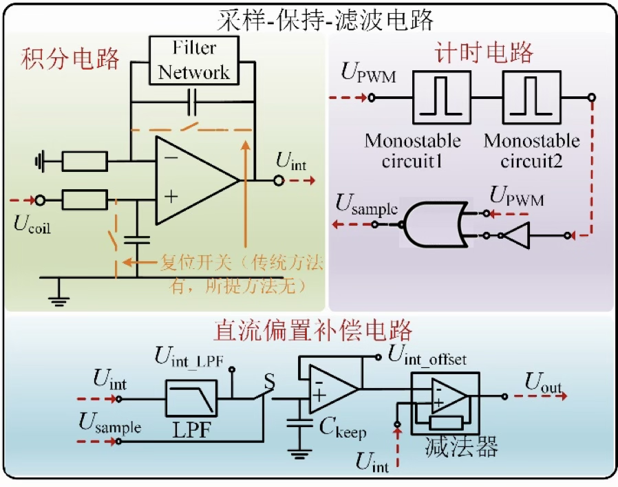
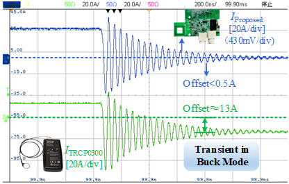

## 项目内容

以罗氏线圈为前置微分电路，后加低直流偏置积分器、直流补偿电路，设计高抗扰性、高灵敏度的罗氏线圈电流传感器。

## 负责工作

以高带宽、低直流偏置、高增益为目标，选择了无源-有源级联积分器。最终测试得到，所设计积分器能够在增益大于10e6的同时，带宽达到33.6MHz。

采用采样-滤波-保持方法（SFH），提取积分器损失的直流成分。完成电路仿真与调试，用 Buck 电流波形核对积分与补偿结果，所提方法将直流偏置从13A降低至0.5A。

<!--  -->