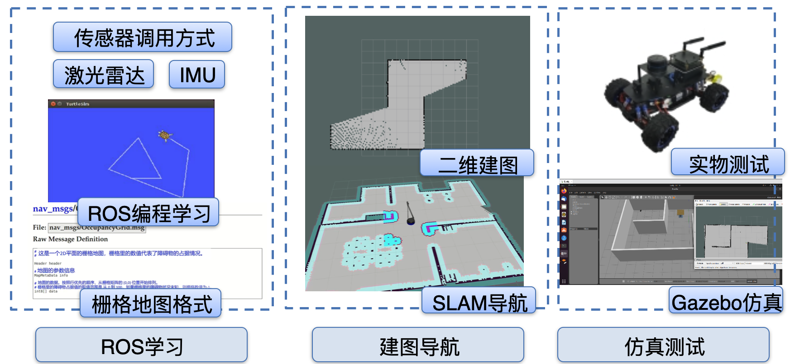
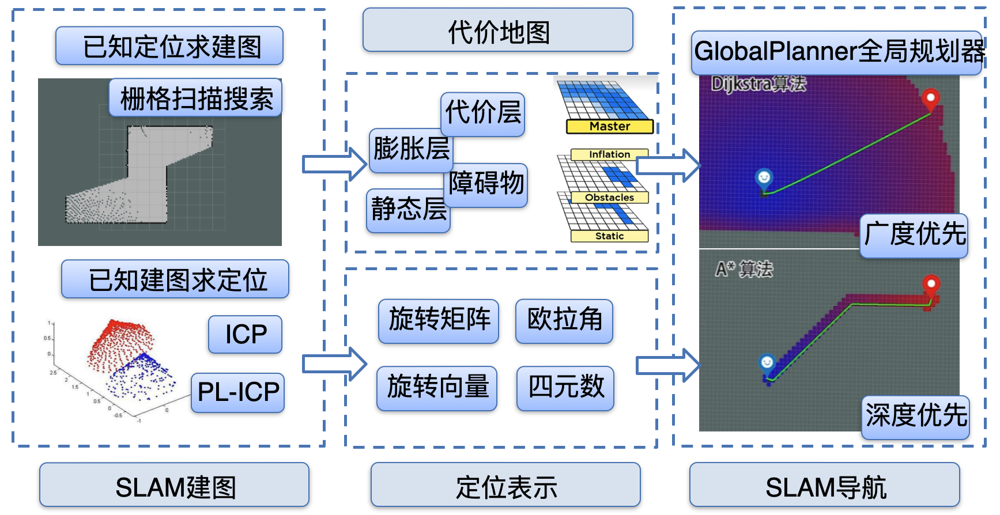

## Project

Using an unused campus vehicle model with a Raspberry Pi as the controller, ROS provided 2D mapping and SLAM navigation.

## Responsibilities

I completed every part of the project.

Learned ROS programming and applications in C, and the basics of SLAM;

Used a lidar, IMU, and other peripherals for 2D mapping and path planning;

Simulated the software in Gazebo on a virtual machine and tested on the campus vehicle model.

