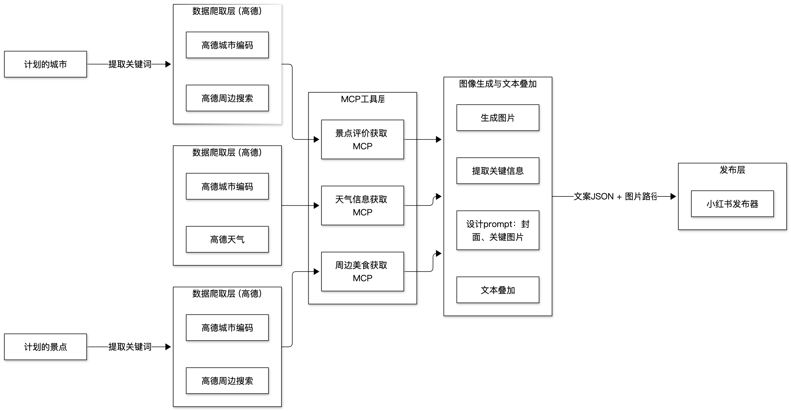

## Project
An AI Agent pipeline in Python covering travel geodata, media generation, and automatic publishing.

## Responsibilities

Wrap Amap APIs with the MCP protocol for geocoding, recent weather, and nearby food;

Use PIL for automatic image layout and text overlay to generate structured blog posts;

Build a publishing tool with Selenium and xhs-toolkit for one-click posts on Xiaohongshu.
