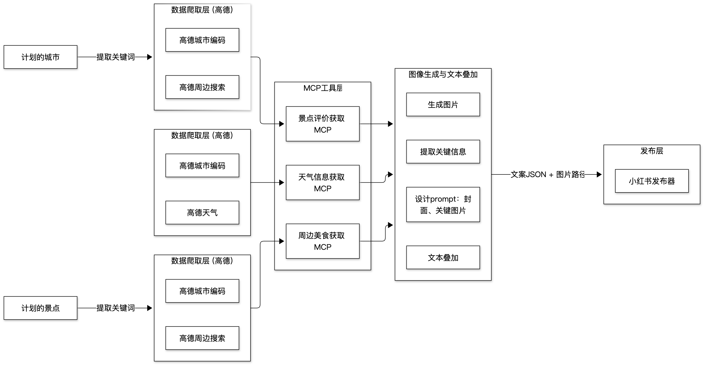

## 项目内容
利用 Python 构建 AI Agent 流水线，实现从旅游地理信息感知、媒体内容生成，到内容自动发布的全流程。

## 负责工作

基于 MCP 协议封装高德 API 工具，实现地理信息编码、近期天气获取、附近美食查询等；

利用 PIL 库 实现自动化的图片排版与文字覆盖，生成结构化博客；

基于 Selenium 和 xhs-toolkit 开发发布工具，在小红书平台实现推文的一键自动发布。
