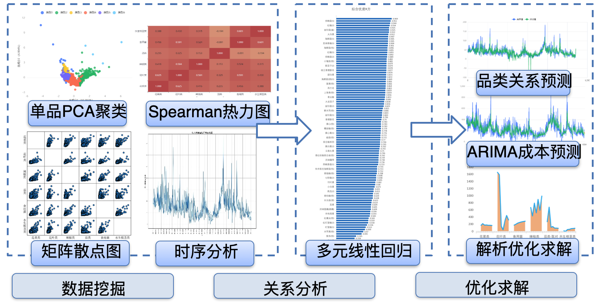
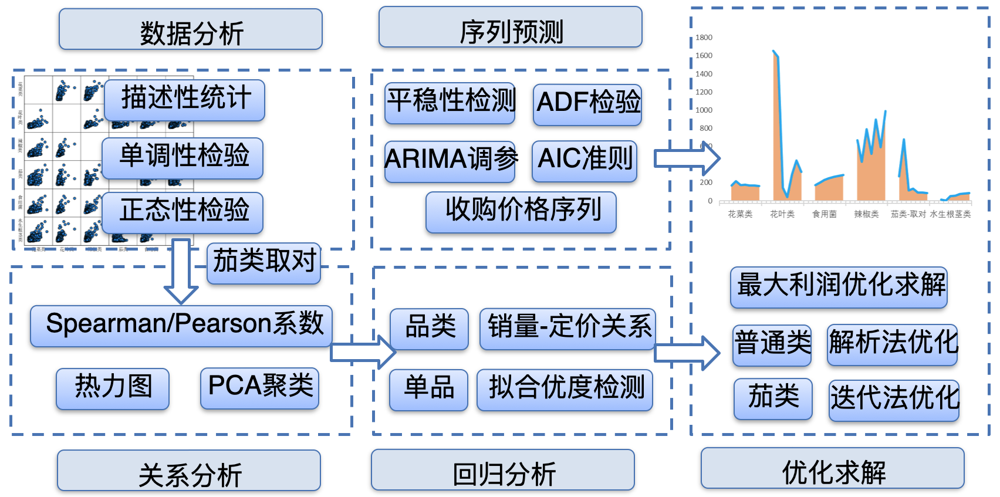

## Project

Vegetables have short shelf lives and limited display space, so we built an optimization model for automatic pricing and replenishment.

## Responsibilities

Led the modeling and helped with part of the programming and the paper.

After clustering items with Spearman correlation, used multiple linear regression with lag terms for sales–price relations in each cluster;

After ADF tests on wholesale price series, used ARIMA to forecast the next week;

Derived pricing and replenishment decisions in closed form and solved them in Matlab.

