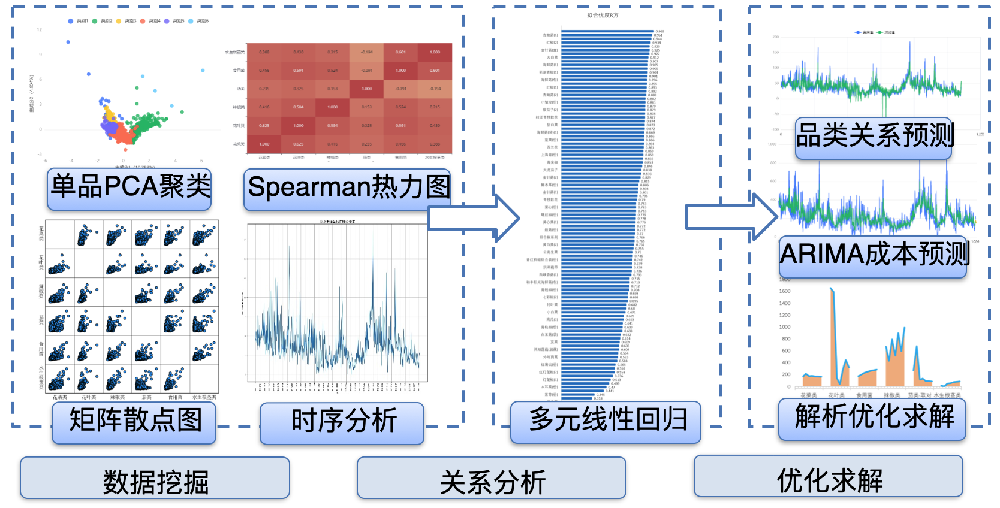
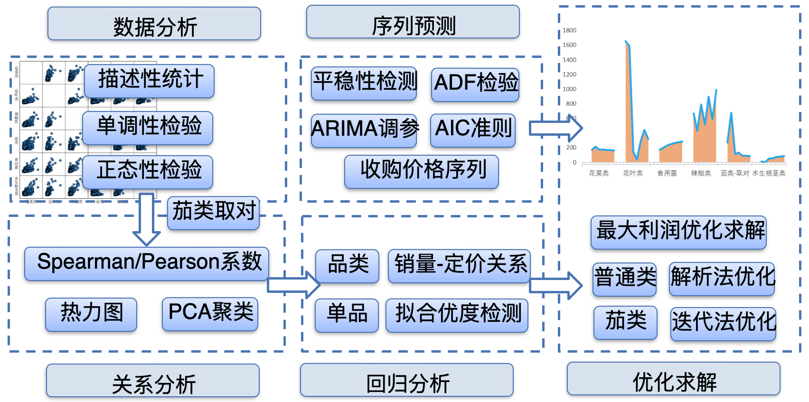

## 项目内容

由于蔬菜类商品保鲜期短，且销售空间有限，我们需要构建其自动定价与补货决策的优化模型。

## 负责工作

主要负责建模工作，辅助完成部分程序和论文编写工作。

利用Spearman相关系数对单品间聚类后，采用带迟滞项的多元线性回归分析每类销量-定价关系；

对品类批发价格序列进行ADF检验后，利用ARIMA模型预测未来一周序列；

采用解析解法得出定价与补货决策，并负责利用matlab进行编程求解。

